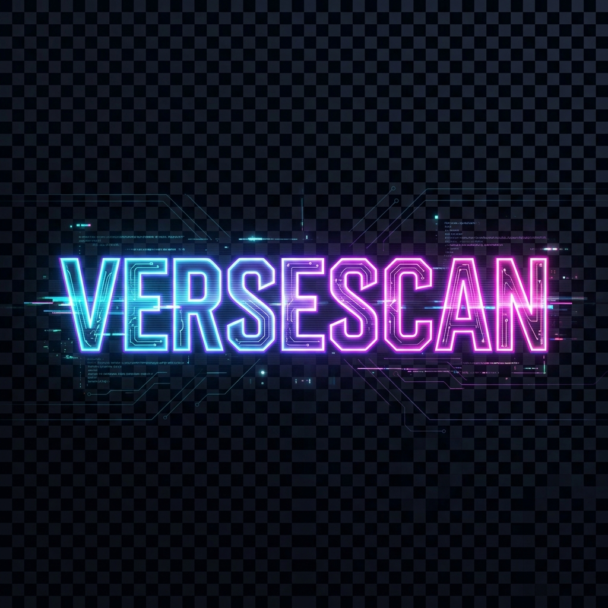

<div align="center">

  
  
  [](https://git.io/typing-svg)

  <p align="center">
    <b>Next-Gen Web Vulnerability Scanner & Dashboard</b><br/>
    Built for the modern web with a Cyber-Glass aesthetic.
  </p>

  <p align="center">
    
    
    
    
    
  </p>

</div>

---

## 🚀 Motto
> **"Safety First."**
> 
> We believe security tools shouldn't look like spreadsheets from 1999. Scancrypt combines **Enterprise-Grade Scanning** with a **Cyberpunk Interface** to make security audits fast, intuitive, and powerful.

---

## ✨ Key Features

| Feature | Description |
| :--- | :--- |
| **🕷️ Neural Spider** | AI-driven crawling engine that finds hidden endpoints and maps attack surfaces. |
| **🎨 Glitch UI/UX** | A stunning glassmorphism dashboard with real-time animations and glitch effects. |
| **⚡ Live Activity** | Watch the scanner work in real-time with a terminal-style log feed. |
| **🛡️ Deep Audit** | Detects **SQLi**, **XSS**, **RCE**, **LFI**, and **Auth Bypass** vulnerabilities. |
| **🔓 Smart Auth** | Supports **Interactive Login** (User-driven) and **Session Cookie** replay. |
| **📄 Instant Reports** | One-click **PDF Report Generation** with professional layouts and remediation steps. |
| **👻 Stealth Mode** | Advanced WAF evasion with randomized headers and delays. |

---

## 🆚 Why Scancrypt?

| Comparison |  **Scancrypt** | 🐢 **Legacy Scanners** |
| :--- | :---: | :---: |
| **Speed** | ⚡ **Real-Time Async** | ⏳ Single-Threaded / Slow |
| **Interface** | 🌌 **Cyber Glass** | 📄 Boring Tables |
| **Config** | ✨ **Zero-Config** | ⚙️ XML Hell |
| **Auth** | 🖱️ **Interactive Click** | ❌ Complex Scripts |
| **Cost** | 💸 **Free & Open** | 💰 $$$ Enterprise |

---

## 🛠️ How to Run Locally

### 1. Clone the Repository
```bash
git clone https://github.com/AdityaGupta32/Scanner.git

```

### 2. Backend Setup (Scanner Engine)
```bash
cd scanner-engine
# Install dependencies
pip install -r requirements.txt
playwright install
# Run the engine
python main.py
```
> Backend runs on `http://localhost:8000`

### 3. Frontend Setup (Dashboard)
```bash
# Open a new terminal
cd dashboard
# Install dependencies
npm install
# Run the dashboard
npm run dev
```
> Frontend runs on `http://localhost:3000`

---

## 👥 Team Members

<table>
  <tr>
    <td align="center">
      <br />
      <b>Aditya Gupta</b>
    </td>
    <td align="center">
      <br />
      <b>Satyam Mishra</b>
    </td>
    <td align="center">
      <br />
      <b>Aditya Gond</b>
    </td>
    <td align="center">
      <br />
      <b>Ashutosh Baharti</b>
    </td>
  </tr>
</table>

---

<div align="center">
  <sub>Built with 💜 by Team Scancrypt for Hacknova</sub>
</div>
